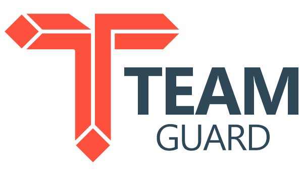

# TeamGuard

**Simplified Team-Based Access Control for Laravel**

TeamGuard is a powerful Laravel package designed to manage users and models through team or department assignments. It enables dynamic access control, hierarchical structures, and secure data filtering with minimal effort.

---

## 📦 Features

- Assign users to teams or departments for streamlined access control.
- Dynamic and hierarchical team-based queries.
- Role-based access filtering for fine-grained control.
- Advanced caching for faster data retrieval.
- Event and listener support for automated workflows.
- API-ready for seamless platform integration.
- Multi-language support for global applications.

---

## 🚀 Installation

Require the package via Composer:

```bash
composer require burakdalyanda/laravel-team-guard
```

Publish the configuration file and migrations:

```bash
php artisan vendor:publish --tag=team-guard-config
php artisan vendor:publish --tag=team-guard-migrations
```

Run migrations:

```bash
php artisan migrate
```
----------

## ⚙️ Configuration

After installation, you can configure the package in the `config/team-guard.php` file. Define your team-related settings, caching options, and default behaviors.

----------

## 🛠 Usage

### Assigning a User to a Team

```php
use App\Models\User;

$user = User::find(1);
$user->assignToTeam('sales');
```

### Managing Hierarchies
```php
$user->assignToTeam('regional_sales', ['parent' => 'global_sales']);
```

### Managing Hierarchies

```php
$user->assignToTeam('regional_sales', ['parent' => 'global_sales']);
```

----------

## 🧪 Testing

To run tests, use the following command:

```bash
php artisan test
```

Make sure to write your custom unit and feature tests to cover your application's specific use cases.

----------

## 🌐 Contributing

Contributions are welcome! Please fork this repository, create a new branch, and submit a pull request.

----------


## 📜 License

This package is open-sourced software licensed under the MIT license.

----------

### Let's simplify team-based access control in Laravel together with **TeamGuard**!
