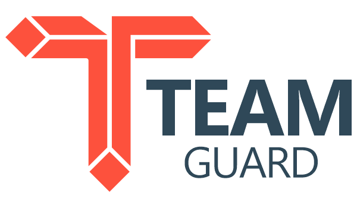

# TeamGuard

TeamGuard adds team membership and hierarchical teams to Laravel Eloquent models. It is intentionally focused: authorization remains in your application's policies and gates, while TeamGuard answers which teams a model belongs to and how teams are arranged.

## Requirements

- PHP 8.3 or later
- Laravel 11, 12, or 13
- A database supported by Laravel

## Installation

Install the package:

```bash
composer require burakdalyanda/laravel-team
```

Publish the migration and configuration, then migrate:

```bash
php artisan vendor:publish --tag=team-guard-config
php artisan vendor:publish --tag=team-guard-migrations
php artisan migrate
```

Add `HasTeams` to every Eloquent model that can receive teams:

```php
namespace App\Models;

use BurakDalyanda\TeamGuard\Traits\HasTeams;
use Illuminate\Database\Eloquent\Model;

final class User extends Model
{
    use HasTeams;
}
```

## Creating a hierarchy

```php
use BurakDalyanda\TeamGuard\Enums\TeamStatus;
use BurakDalyanda\TeamGuard\Models\Team;

$company = Team::create([
    'name' => 'Company',
    'status' => TeamStatus::Active,
]);

$engineering = Team::create([
    'name' => 'Engineering',
    'parent_id' => $company->getKey(),
]);

$platform = Team::create([
    'name' => 'Platform',
    'parent_id' => $engineering->getKey(),
]);

$company->children;       // direct children
$company->descendants();  // all descendants
$platform->ancestors();   // Engineering, Company
$company->isAncestorOf($platform); // true
```

TeamGuard rejects self-parenting and changes that would introduce a hierarchy cycle. Deleting a parent does not delete its children; they become root teams.

Useful query scopes are available:

```php
Team::active()->ordered()->get();
Team::roots()->with('childrenRecursive')->get();
```

## Assigning teams

Methods accept a persisted team model, a numeric ID, or an existing team name:

```php
$user->assignTeam($engineering);
$user->assignTeam($engineering->getKey());
$user->assignToTeam('Engineering'); // compatibility alias

$user->hasTeam($engineering);
$user->hasAnyTeam($engineering, $platform);
$user->hasAllTeams($engineering, $platform);
$user->getTeamIds();
$user->firstTeam();

$user->removeTeam($engineering);
$user->syncTeams([$engineering, $platform]);
$user->syncTeamsWithoutDetaching([$platform]);
```

Assignment is idempotent. Passing an unknown name fails with `ModelNotFoundException`; TeamGuard never creates teams implicitly.

Legacy v1 method names `syncTeam()`, `syncTeamWithoutDetach()`, and `getModelTeam()` remain as compatibility aliases. New code should use the plural methods and `firstTeam()`.

## Filtering teamable models

```php
User::whereTeam($engineering)->get();
User::whereAnyTeam($engineering, $platform)->get();
User::whereAllTeams($engineering, $platform)->get();
User::withoutTeams()->get();
```

These scopes operate on the polymorphic relationship and respect Eloquent morph maps.

## Events

TeamGuard dispatches events after membership persistence succeeds:

- `TeamAssigned` once for each newly attached team
- `TeamRemoved` once for each detached team
- `TeamsSynced` after a sync that changed membership

Each assignment/removal event exposes `model` and `team`. `TeamsSynced` exposes the Eloquent sync change set. Membership mutations are transactional and serialized per teamable model; events implement Laravel's after-commit contract so listeners do not observe rolled-back changes.

```php
use BurakDalyanda\TeamGuard\Events\TeamAssigned;

final class RecordTeamAssignment
{
    public function handle(TeamAssigned $event): void
    {
        // $event->model and $event->team are persisted Eloquent models.
    }
}
```

## Configuration

`config/team-guard.php` controls the team model, table names, pivot keys, morph name, and teamable key type.

To use a custom team model, extend the package model and update the configuration:

```php
namespace App\Models;

use BurakDalyanda\TeamGuard\Models\Team as BaseTeam;

final class Team extends BaseTeam
{
}
```

```php
'models' => [
    'team' => App\Models\Team::class,
],
```

For teamable models using UUIDs or ULIDs, set `model_key_type` before publishing the migration:

```php
'model_key_type' => 'uuid', // int, uuid, or ulid
```

If the migration was already published, modify the published migration before running it. Changing key types after production data exists requires an application-specific data migration.

## Authorization

Team membership is context, not authorization by itself. Enforce access with Laravel policies or gates:

```php
public function view(User $user, Report $report): bool
{
    return $user->hasAnyTeam($report->teams->all());
}
```

Do not expose records solely because a client supplied a team ID. Resolve authorization from the authenticated model's persisted memberships.

## Development

```bash
composer install
composer verify
```

`composer verify` validates Composer metadata, checks formatting, runs Larastan, and executes the PHPUnit suite. CI runs the behavioral suite against Laravel 11, 12, and 13.

See [UPGRADING.md](UPGRADING.md) before moving from v1 and [CONTRIBUTING.md](CONTRIBUTING.md) for the contribution workflow.

## License

TeamGuard is open-source software licensed under the [MIT license](LICENSE).
